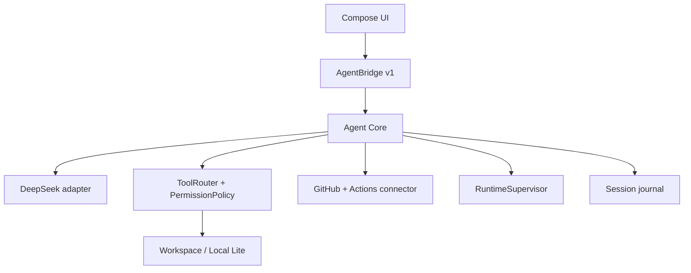

# План архитектуры и реализации Deep Agent

> Статус: утверждённый план реализации рабочего прототипа.
> Последнее обновление: 2026-09-16.
> В текущем проходе выполнены очистка структуры и обновление документации; workflow переведён на ручной запуск.
> Сборка и тесты не запускались: они выполняются только отдельной явной командой.

## 1. Продуктовый контракт

`Deep_Agent_Mobile` — одно цельное Android-приложение и один APK для инженерных задач:

- писать и редактировать код, документацию и архитектуру;
- анализировать ошибки, stack trace, фото и скриншоты;
- составлять планы и объяснять решения;
- читать workspace и историю Git;
- предлагать и применять безопасные patch-изменения;
- работать с GitHub, commit, Pull Request и Actions;
- запускать тяжёлую Android-сборку удалённо и возвращать проверенный APK/AAB.

Пользователь не устанавливает второй APK, Termux или отдельную графическую оболочку. Headless DSH/Node runtime, если он будет подключён, остаётся внутренним заменяемым исполнителем.

Неподвижные ограничения:

- один APK — единственная пользовательская поставка;
- Android 16+ — основная платформа тестирования, но `minSdk` не повышается автоматически до 36;
- GitHub Actions — основной способ тяжёлой сборки;
- локальный runtime используется для лёгких операций и быстрых проверок;
- серверные plugins не устанавливаются и не изменяются приложением;
- UI не зависит от внутренних endpoint runtime;
- внешний write не выполняется только потому, что модель написала такую инструкцию.

## 2. Что есть сейчас

Текущий APK — рабочий вертикальный срез, но ещё не автономный coding agent.

| Компонент | Текущее состояние |
| --- | --- |
| `AgentMobileApp` / Compose UI | Нативный Agent Console: задача, target, permission, image input, конфигурация и события |
| `AgentBridge v1` | `submit`, `cancel`, `clearEvents`, state и ordered event stream |
| `AgentCore` | AUTO-маршрутизация, Local Lite probe, DeepSeek streaming, Actions dispatch |
| `LocalLiteRunner` | Только health probe в app-private workspace |
| `DeepSeekResponsesClient` | Responses API, semantic SSE, reasoning/output/tool delta events |
| `GitHubActionsClient` | Dispatch workflow с `repository`, `workflow`, `ref` и task input |
| Image input | Android URI → bytes → data URL → `input_image` |
| Разрешения | `READ_ONLY`, `LOCAL_WRITE`, `GITHUB_WRITE`, `PR_CREATE`, `MERGE_RELEASE` |
| CI | GitHub Actions собирает debug APK; release asset используется при переполнении artifact storage |

Сейчас не реализованы: полноценный ToolRouter, чтение файлов, tool loop, журнал сессий, diff/apply_patch, Git/PR, polling Actions, job logs, artifact verification и headless runtime.

## 3. Целевая архитектура



### 3.1 Compose UI

UI отвечает только за ввод и отображение:

- задача и история текущей сессии;
- выбор `AUTO`, `LOCAL_LITE`, `REMOTE_ACTIONS`;
- выбор permission level;
- конфигурация DeepSeek/GitHub;
- attachment preview;
- diff/approval/build/artifact cards;
- отмена, повтор и восстановление.

UI не вызывает GitHub REST, shell, DSH или файловую систему напрямую. Он работает через `AgentBridge` и получает события с correlation/session ID.

### 3.2 AgentBridge v1

Это стабильная граница между пользовательской оболочкой и исполнителями. Базовый контракт сохраняется:

- `submit(AgentRequest)`;
- `cancel()`;
- `clearEvents()`;
- `StateFlow<AgentSessionState>`;
- `StateFlow<List<AgentEvent>>`.

Расширять контракт нужно обратно совместимо: новые tool/build/runtime события добавляются в поток событий, а не превращают UI в клиент внутреннего runtime.

### 3.3 Agent Core

Agent Core владеет жизненным циклом одной сессии:

1. валидирует задачу и конфигурацию;
2. назначает `sessionId` и выбирает target;
3. создаёт plan event;
4. вызывает DeepSeek;
5. принимает output или tool call;
6. проверяет permission и scope;
7. передаёт tool call исполнителю;
8. возвращает tool result модели;
9. показывает diff/build/artifact результат;
10. завершает или ставит сессию на паузу.

Agent Core не должен считать действие выполненным до получения результата от реального исполнителя.

### 3.4 Providers и исполнители

| Provider | Роль | Когда используется |
| --- | --- | --- |
| DeepSeek | reasoning, план, ответ, tool calls, image input | каждая интеллектуальная сессия |
| Local Lite | быстрые read-only операции и лёгкие проверки | анализ документации и небольших workspace |
| GitHub API | репозитории, branches, commits, PR | внешние операции и синхронизация |
| GitHub Actions | Android/NDK/CMake/долгие тесты и APK | тяжёлые сборки |
| Headless runtime | shell/PTY/DSH после стабилизации | только после P0/P1 |

Каждый provider имеет отдельный интерфейс, timeout, cancellation, redaction и нормализованный результат.

## 4. Рабочий прототип с минимальным запуском

Цель ближайшего MVP — запуск без Termux, ручного копирования runtime и длинной настройки.

### 4.1 Первый запуск

1. APK открывает одну Agent Console.
2. По умолчанию выбраны `AUTO` и `READ_ONLY`.
3. Базовые параметры уже заполнены: `https://api.deepseek.com` и `deepseek-flash`.
4. Пользователь вводит DeepSeek API key только при необходимости реального ответа.
5. Для remote build пользователь указывает GitHub token, `owner/repository`, workflow и ref.
6. При отсутствии ключа приложение работает в offline/local probe режиме и объясняет, что именно не настроено.

До появления безопасного постоянного хранилища токены находятся только в памяти сессии и никогда не попадают в event detail, crash log или artifact.

### 4.2 Базовый путь задачи

```text
задача → валидация → план → запрос DeepSeek → reasoning/output → результат
```

Для задачи «собрать APK» AUTO выбирает `REMOTE_ACTIONS`. Для анализа, документации и лёгкой проверки — `LOCAL_LITE`. Любой write переводит сессию в approval gate.

### 4.3 Что нужно добавить, чтобы прототип стал реально полезным

- `WorkspaceSource`: app-private folder, импорт ZIP/папки через Storage Access Framework и read-only snapshot GitHub;
- `ToolRouter`: `list_files`, `read_file`, `search_code`, `git_status`, `git_diff`;
- `ConversationStore`: история prompt/response/tool rounds;
- `ConfigStore`: единая проверяемая конфигурация провайдеров;
- `ApprovalController`: отдельное подтверждение перед write, push, PR, merge и release;
- `ActionsRunTracker`: run ID, status и ссылка на workflow;
- единые UI-карточки `TOOL`, `BUILD`, `DIFF`, `ARTIFACT`, `APPROVAL`.

Это минимальный рабочий контур. Полный headless DSH и PTY не являются условием первого полезного прототипа.

## 5. Контракты данных

### 5.1 Request

`AgentRequest` должен постепенно получить:

- `sessionId`;
- task и conversation ID;
- target и permission;
- workspace ID/root;
- provider configuration reference;
- image attachments;
- repository/ref/workflow;
- cancellation/deadline metadata.

Секреты не помещаются в сериализуемый event journal в открытом виде.

### 5.2 Tool call/result

Будущий типизированный контракт:

| Поле | Требование |
| --- | --- |
| `invocationId` | уникален в рамках session |
| `toolName` | allowlist, не произвольная shell-команда |
| `arguments` | JSON schema + лимиты |
| `permission` | проверяется до запуска |
| `workspaceScope` | нормализованный root и target paths |
| `timeout` | обязательный deadline |
| `result` | stdout/data/error + truncation metadata |

Каждый вызов и результат становятся отдельными `TOOL` events.

### 5.3 Session journal

Журнал хранит versioned records:

- request и выбранный target;
- plan, reasoning/output metadata;
- tool calls/results;
- approval decisions;
- diff/commit/run/artifact references;
- final status и error.

Восстановление после process death не повторяет уже завершённый вызов. Незавершённый вызов отмечается `UNKNOWN` и требует re-check, а не слепого повтора.

## 6. Permission Policy

| Операция | READ_ONLY | LOCAL_WRITE | GITHUB_WRITE | PR_CREATE | MERGE_RELEASE |
| --- | ---: | ---: | ---: | ---: | ---: |
| plan/read/search/diff | yes | yes | yes | yes | yes |
| apply_patch/local file write | no | approval | approval | approval | approval |
| branch/commit/push | no | no | approval | approval | approval |
| workflow dispatch | no | no | approval | approval | approval |
| create PR | no | no | no | approval | approval |
| merge/release | no | no | no | no | approval |

Право проверяется в Agent Core непосредственно перед действием. Permission из текста модели не считается разрешением пользователя.

## 7. Пошаговый путь реализации

### P0-0 — Очистка Deep Agent (текущий шаг)

Задача: оставить в репозитории только собственный Deep Agent.

- [x] не включать внешний web/mobile-adapter в проект;
- [x] убрать agent namespace `dev.harness.mobile.agent`;
- [x] заменить Harness-specific icon/comment/network wording;
- [x] сохранить только нативный Agent Console, providers и Android runtime основу;
- [x] обновить README, architecture, ideas и roadmap;
- [x] не менять server plugins;
- [x] не запускать build/test без команды.

Критерий выхода: в исходниках нет старого package namespace, web assets, профилей внешнего сервера или UI-пунктов другого приложения; остаются только явные boundary-документы.

### P0-A — Workspace и read-only ToolRouter

Задача: агент должен уметь читать проект и анализировать ошибку, не изменяя файлы.

Порядок:

1. Ввести `WorkspaceManager` с app-private root и `WorkspaceSource`.
2. Нормализовать пути; запретить `..`, symlink escape и выход из root.
3. Ввести лимиты file size, result count, recursion depth и output bytes.
4. Реализовать `list_files`, `read_file`, `search_code`.
5. Реализовать `git_status` и `git_diff` read-only.
6. Добавить fake filesystem/router для контрактных тестов.
7. Подключить tool schemas к DeepSeek request и tool result round-trip.

Критерий выхода: модель может получить список, содержимое, поиск и diff; приложение показывает источник и лимиты; workspace не меняется.

### P0-B — Conversation и session recovery

Задача: длинная инженерная сессия переживает rotation, background и process death.

- versioned `SessionRecord` и event journal;
- ограниченный размер событий и сворачивание старых reasoning chunks;
- сохранение `sessionId`, invocation IDs, run IDs и approval decisions;
- восстановление только подтверждённого состояния;
- status machine: `IDLE`, `RUNNING`, `WAITING_APPROVAL`, `PAUSED`, `FAILED`, `COMPLETED`, `CANCELLED`;
- отдельное пользовательское summary вместо вывода всего технического журнала.

Критерий выхода: восстановленная сессия не повторяет завершённые read/tool/build операции и объясняет неизвестное состояние.

### P0-C — MVP setup и понятный результат

Задача: сократить запуск до одного экрана и одной кнопки.

- единая `ProviderConfig` с inline validation;
- health-check DeepSeek и GitHub без раскрытия токенов;
- понятные сообщения «offline», «нет ключа», «нет repository/workflow»;
- default target `AUTO`, permission `READ_ONLY`;
- event cards с группировкой reasoning/output/tool/build;
- отмена, очистка и повтор сессии;
- attachment preview без обращения к локальному пути из сообщения.

Критерий выхода: новый пользователь может понять, что запустить, какие данные отсутствуют и почему операция остановилась.

### P1-A — Diff, controlled write, Git и ручной PR

Задача: агент вносит изменения только через проверяемый diff.

Порядок:

1. Добавить `apply_patch` с unified diff/structured patch parser.
2. Показать preview целевых файлов и итоговый diff.
3. Проверить path scope, base content hash, conflicts и file size.
4. Запросить `LOCAL_WRITE` approval непосредственно перед записью.
5. Реализовать branch/commit/push через отдельный GitHub provider.
6. Связать каждый write с session ID, repository, ref и SHA.
7. Реализовать `create_pull_request` только при `PR_CREATE`.

Автоматический PR после ответа модели на этом этапе запрещён; PR создаётся явным действием.

Критерий выхода: любой патч обратим через diff, write имеет approval event, commit/PR имеют проверяемый SHA.

### P1-B — GitHub Actions observability и APK

Задача: пользователь видит весь путь удалённой сборки в том же APK.

- dispatch возвращает или находит `runId`;
- polling с backoff и cancellation;
- run/job/step status, duration и failed step;
- job logs с truncation и secret redaction;
- failed-job retry только по permission;
- список artifacts;
- скачивание APK/AAB в workspace;
- проверка content type, размер, checksum, commit SHA и expected variant;
- отображение прямой ссылки и локального пути.

Критерий выхода: путь `dispatch → run → job → log → artifact` наблюдаем без ручного открытия GitHub.

### P1-C — Android 16 UI и regression contract

Задача: защитить нативную оболочку перед расширением runtime.

- Agent Console task input;
- target/permission dropdowns;
- provider configuration и secret masking;
- image picker/preview;
- events, errors, cancel/retry;
- rotation, background/foreground, insets и accessibility semantics;
- стабильные test tags, не зависящие от языка;
- screenshot regression только для согласованных критических состояний.

Критерий выхода: основной пользовательский поток повторяем на Android 16 и не теряет сессию при переходах.

### P2-A — RuntimeSupervisor и headless DSH

Задача: добавить внутренний runtime, не превращая его в UI API.

State machine `RuntimeSupervisor`:

```text
EMPTY → INSTALLING → STARTING → READY → STOPPING → EMPTY
                         ↘ FAILED → ROLLBACK
```

Порядок:

1. Выбрать ARM64 Node.js/DSH bundle и зафиксировать версию.
2. Хранить manifest и SHA-256 рядом с bundle.
3. Распаковывать атомарно в app-private storage.
4. Проверять executable, ABI, version и readiness probe.
5. Запускать процесс под supervisor с timeout/heartbeat.
6. Использовать loopback adapter за `AgentBridge`, без прямой связи UI с endpoint DSH.
7. Добавить controlled shutdown, crash recovery и rollback.
8. Для долгой работы использовать foreground service и понятное уведомление.

Критерий выхода: отказ runtime не повреждает workspace и не блокирует нативный Agent Core; второй APK и Termux не нужны.

### P2-B — PTY и интерактивные команды

Только после P2-A:

- определить PTY backend для ARM64;
- ограничить persistent shell workspace и environment;
- обеспечить cancel/process tree cleanup;
- восстановить или явно завершить потерянный процесс;
- запретить произвольное выполнение команды только из текста модели.

Критерий выхода: интерактивная команда не блокирует UI и не выходит за permission/workspace scope.

## 8. Фото, OCR и генерация

### Уже есть

- URI читается через `ContentResolver`;
- bytes кодируются в data URL;
- DeepSeek получает `input_image`;
- размер inline input ограничивается.

### После стабилизации P0/P1

- resize и EXIF/orientation normalization;
- OCR текста и stack trace;
- выделение области и сравнение двух UI screenshots;
- генерация SVG/Compose/HTML через Agent Core;
- отдельный `ImageGenerator` provider для raster output.

Генерация растровых изображений не считается автоматически доступной возможностью текущего DeepSeek adapter.

## 9. Безопасность и секреты

Текущая безопасная база:

- `READ_ONLY` по умолчанию;
- токены только в памяти сессии;
- redaction в событиях;
- нет произвольного shell tool;
- нет неявного write.

До отдельного решения D3 нельзя:

- записывать токены в plaintext preferences или journal;
- отправлять токены модели;
- вставлять секреты в task input или artifact detail;
- считать успешным действие без подтверждённого результата provider.

После P0 выбирается один из вариантов хранения: Android Keystore, внешний proxy или сессионная схема с повторным вводом.

## 10. Что сознательно не входит в текущий MVP

- второй APK;
- обязательная установка Termux;
- Android SDK/NDK внутри базового APK;
- полноценный PTY;
- автоматический PR/merge/release;
- изменение server plugins;
- внешняя web-оболочка как обязательная часть Deep Agent;
- бесконтрольное выполнение shell-команд;
- постоянное хранение токенов без отдельного решения.

## 11. Структура исходников

Текущая и целевая схема:

```text
app/src/main/java/dev/deepagent/mobile/
├── MainActivity.kt
├── AgentMobileApp.kt
├── ui/theme/
└── agent/
    ├── core/AgentCore.kt
    ├── deepseek/DeepSeekResponsesClient.kt
    ├── github/GitHubActionsClient.kt
    ├── model/AgentModels.kt
    ├── protocol/AgentBridge.kt
    ├── runtime/LocalLiteRunner.kt
    ├── ui/AgentConsoleScreen.kt
    ├── tools/ToolRouter.kt              # P0-A
    ├── workspace/WorkspaceManager.kt    # P0-A
    ├── session/SessionStore.kt          # P0-B
    ├── policy/PermissionPolicy.kt       # P0-C
    └── runtime/RuntimeSupervisor.kt     # P2-A
```

Пока Gradle остаётся одним Android module. Новые Kotlin-пакеты вводятся раньше, чем отдельные Gradle modules; выделение modules оправдано только при появлении независимых тестируемых boundaries.

## 12. Проверка результата по этапам

Для каждого этапа должны существовать:

- контракт входа/выхода;
- permission gate;
- correlation/session ID;
- redacted event trail;
- cancellation/timeout;
- failure and recovery behavior;
- критерий выхода, проверяемый отдельно.

В этом проходе такие проверки не запускаются. Команда на сборку/тесты должна быть дана отдельно пользователем; до неё ограничиваемся чтением дерева, diff и статическим контролем изменений.

## 13. Не менять без отдельного решения

- один APK;
- `AgentBridge v1` как UI/runtime boundary;
- DeepSeek adapter как заменяемый provider;
- GitHub Actions как основной heavy-build path;
- `READ_ONLY` по умолчанию и раздельные permission levels;
- отсутствие обязательного Termux/DSH APK;
- отсутствие server plugin mutations;
- правило: модель не может сама выдать себе permission.

## Definition of Done

- новый пользователь запускает задачу из одной Agent Console;
- read-only анализ не меняет workspace;
- каждый write показывает diff и требует approval;
- GitHub операция связана с repository/ref/SHA/session ID;
- Actions run, logs и artifacts видны и проверены;
- runtime отказоустойчив и заменяем;
- восстановление сессии не повторяет завершённые операции;
- APK остаётся единственной поставкой;
- документация обновляется вместе с реализацией;
- серверные plugins не изменяются.
